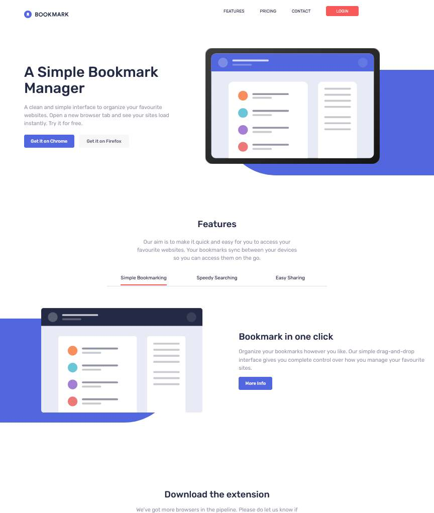

# Frontend Mentor - Bookmark landing page solution

This is a solution to the [Bookmark landing page challenge on Frontend Mentor](https://www.frontendmentor.io/challenges/bookmark-landing-page-5d0b588a9edda32581d29158). Frontend Mentor challenges help you improve your coding skills by building realistic projects. 

## Table of contents

- [Overview](#overview)
  - [The challenge](#the-challenge)
  - [Screenshot](#screenshot)
  - [Links](#links)
- [My process](#my-process)
  - [Built with](#built-with)
  - [What I learned](#what-i-learned)
  - [Continued development](#continued-development)
  - [Useful resources](#useful-resources)
- [Author](#author)

**Note: Delete this note and update the table of contents based on what sections you keep.**

## Overview

### The challenge

Users should be able to:

- View the optimal layout for the site depending on their device's screen size
- See hover states for all interactive elements on the page
- Receive an error message when the newsletter form is submitted if:
  - The input field is empty
  - The email address is not formatted correctly

### Screenshot

### Links

- Solution URL: [https://github.com/2emeagauche/frontend-mentor-bookmark-landing-page](https://github.com/2emeagauche/frontend-mentor-bookmark-landing-page)
- Live Site URL: [https://2emeagauche.github.io/frontend-mentor-bookmark-landing-page/](https://2emeagauche.github.io/frontend-mentor-bookmark-landing-page/)

## My process

### Built with

- **Tailwindcss**
- Semantic HTML5 markup
- Flexbox
- Mobile-first workflow
- Vanilla css

### What I learned

This challenge is part of the course about css frameworks: Bootstrap and Tailwindcss.
I choose Tailwindcss to complete the challenge.
It was very challenging as the html get so messy with all these classes.

### Continued development

I would like to learned why Tailwindcss is so trendy.
I clearly don't know how to work DRY with it and I would like to learn the best practices with Tailwindcss.

### Useful resources

- [Tools and Techniques to Create Accessible Accordion Components](https://www.a11y-collective.com/blog/accessible-accordion/)
- [Accessible Tablist widgets](https://www.accessibility-developer-guide.com/examples/widgets/tablists/)

## Author

- Website - [My Github](https://github.com/2emeagauche)
- Frontend Mentor - [@2emeagauche](https://www.frontendmentor.io/profile/2emeagauche)